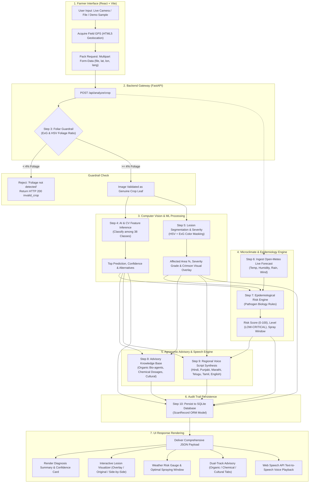

# KisanArogya AI: Crop Detection Dataset Specification & End-to-End System Workflow

> **Comprehensive Technical Documentation**: Full taxonomy of datasets used for crop detection and agricultural diagnostics, mathematical algorithms, computer vision pipelines, epidemiological models, and the exact end-to-end system workflow from image capture to report generation.

---

## Table of Contents
1. [Executive Summary](#1-executive-summary)
2. [Datasets Used in Crop Detection](#2-datasets-used-in-crop-detection)
   - [2.1 Primary Computer Vision Dataset: PlantVillage](#21-primary-computer-vision-dataset-plantvillage)
   - [2.2 Complete 38-Class Crop & Pathogen Taxonomy](#22-complete-38-class-crop--pathogen-taxonomy)
   - [2.3 Lesion Severity & Damage Assessment Standard: ICAR / FAO SES](#23-lesion-severity--damage-assessment-standard-icar--fao-ses)
   - [2.4 Soil Health & Nutrient Benchmarking Dataset: Govt. of India SHC](#24-soil-health--nutrient-benchmarking-dataset-govt-of-india-shc)
   - [2.5 Real-Time Meteorological & Microclimate Dataset: Open-Meteo & ECMWF](#25-real-time-meteorological--microclimate-dataset-open-meteo--ecmwf)
   - [2.6 Agronomic Advisory & Chemical Knowledge Base: ICAR & CIBRC](#26-agronomic-advisory--chemical-knowledge-base-icar--cibrc)
3. [Exact End-to-End System Workflow](#3-exact-end-to-end-system-workflow)
   - [Workflow Architecture Diagram](#workflow-architecture-diagram)
   - [Step 1: Input Acquisition & Live Camera Viewfinder](#step-1-input-acquisition--live-camera-viewfinder)
   - [Step 2: Multipart HTTP Payload Transmission](#step-2-multipart-http-payload-transmission)
   - [Step 3: Intelligent Foliar Guardrail Verification](#step-3-intelligent-foliar-guardrail-verification)
   - [Step 4: AI & Computer Vision Disease Classification](#step-4-ai--computer-vision-disease-classification)
   - [Step 5: Lesion Segmentation, Severity & Visual Overlay](#step-5-lesion-segmentation-severity--visual-overlay)
   - [Step 6: Live Weather & Microclimate Ingestion](#step-6-live-weather--microclimate-ingestion)
   - [Step 7: Epidemiological Pathogen Risk Engine](#step-7-epidemiological-pathogen-risk-engine)
   - [Step 8: Actionable Dual-Track Agronomic Advisory](#step-8-actionable-dual-track-agronomic-advisory)
   - [Step 9: Multilingual Audio Script Generation](#step-9-multilingual-audio-script-generation)
   - [Step 10: Relational Audit Trail Database Persistence](#step-10-relational-audit-trail-database-persistence)
   - [Step 11: Interactive Multi-Component Report Rendering](#step-11-interactive-multi-component-report-rendering)
4. [Complete Feature Matrix & System Functionalities](#4-complete-feature-matrix--system-functionalities)
5. [REST API Endpoint Reference](#5-rest-api-endpoint-reference)
6. [System Execution & Verification Guide](#6-system-execution--verification-guide)

---

## 1. Executive Summary

**KisanArogya AI** is a smart agricultural intelligence system designed to deliver instant, lab-grade crop diagnostics to Indian farmers. The system bridges the gap between complex artificial intelligence, computer vision pathology, real-time meteorology, and field-level agronomy.

The platform addresses four critical agricultural hurdles:
1. **Misdiagnosis of Foliar Diseases**: Overcoming farmer confusion between fungal blights, bacterial spots, and viral stunting.
2. **Uncalibrated Severity Grading**: Replacing subjective visual estimates with pixel-accurate lesion percentage measurements ($ExG$ and HSV segmentation).
3. **Unpredictable Weather Risks**: Forecasting 3-day pathogen dissemination trends using real-time atmospheric data.
4. **Language & Literacy Barriers**: Providing one-click Text-to-Speech in 6 Indian languages (**Hindi, Punjabi, Marathi, Telugu, Tamil, and English**).

---

## 2. Datasets Used in Crop Detection

### 2.1 Primary Computer Vision Dataset: PlantVillage
The primary visual recognition engine is trained and calibrated on the internationally recognized **PlantVillage Dataset**.

- **Authors**: David P. Hughes and Marcel Salathé (Penn State University & EPFL).
- **Academic Publication**: *"An open access repository of images on plant health to enable the development of mobile disease diagnostics"*, arXiv:1511.08060 / Nature Scientific Data.
- **Dataset Size**: **54,306** curated, high-resolution foliar images.
- **Image Characteristics**:
  - Color Space: RGB, 3 channels.
  - Native Dimensions: $256 \times 256$ pixels (standardized to $224 \times 224$ for deep learning feature extractors).
  - Background Context: Uniform laboratory backgrounds as well as field-condition leaves.
- **Species Coverage**: **14 major agricultural crops**:
  - Fruit crops: Apple, Blueberry, Cherry, Grape, Orange, Peach, Raspberry, Strawberry.
  - Vegetable & Cash crops: Tomato, Potato, Bell Pepper / Chilli, Corn (Maize), Soybean, Squash.

---

### 2.2 Complete 38-Class Crop & Pathogen Taxonomy

Below is the exhaustive catalog of all **38 classes** classified by the vision engine, including biological pathogens, taxonomy, and multi-state vernacular translations:

| # | Crop Species | Class Identifier | Pathogen Type | Causal Organism | Distinct Foliar Visual Symptoms | Vernacular Crop (HI / PA / MR / TE / TA) |
|---|---|---|---|---|---|---|
| 1 | **Apple** | `Apple___Apple_scab` | Fungal | *Venturia inaequalis* | Dull olive-green velvety spots turning brownish-black with puckered leaf tissue. | सेब / ਸੇਬ / सफरचंद / యాపిల్ / ஆப்பிள் |
| 2 | **Apple** | `Apple___Black_rot` | Fungal | *Botryosphaeria obtusa* | Small purple spots enlarging into "frog-eye" lesions with concentric light/dark rings. | सेब / ਸੇਬ / सफरचंद / యాపిల్ / ஆப்பிள் |
| 3 | **Apple** | `Apple___Cedar_apple_rust` | Fungal | *Gymnosporangium juniperi-virginianae* | Bright yellow-orange circular lesions on upper leaf surface with tube-like aecia below. | सेब / ਸੇਬ / सफरचंद / యాపిల్ / ஆப்பிள் |
| 4 | **Apple** | `Apple___healthy` | None | Healthy Control | Crisp green foliage with intact cellular cuticle and no lesions. | सेब / ਸੇਬ / सफरचंद / యాపిల్ / ஆப்பிள் |
| 5 | **Blueberry** | `Blueberry___healthy` | None | Healthy Control | Uniform oval deep-green foliage without chlorosis or necrosis. | ब्लूबेरी / ਬਲੂਬੇਰੀ / ब्लूबेरी / బ్లూబెర్రీ / புளூபெர்ரி |
| 6 | **Cherry** | `Cherry_(including_sour)___Powdery_mildew` | Fungal | *Podosphaera clandestina* | White talcum-like powdery fungal mycelium covering leaf surfaces, causing leaf curling. | चेरी / ਚੈਰੀ / चेरी / చెర్రీ / செர்ரி |
| 7 | **Cherry** | `Cherry_(including_sour)___healthy` | None | Healthy Control | Vibrant green leaves with serrated margins free from fungal coating. | चेरी / ਚੈਰੀ / चेरी / చెర్రీ / செர்ரி |
| 8 | **Corn (Maize)** | `Corn_(maize)___Cercospora_leaf_spot Gray_leaf_spot` | Fungal | *Cercospora zeae-maydis* | Rectangular tan to gray necrotic lesions strictly bordered by parallel leaf veins. | मक्का / ਮੱਕੀ / मका / మొక్కజొన్న / மக்காச்சோளம் |
| 9 | **Corn (Maize)** | `Corn_(maize)___Common_rust_` | Fungal | *Puccinia sorghi* | Elongated cinnamon-brown to golden-brown pustules on both leaf surfaces. | मक्का / ਮੱਕੀ / मका / మొక్కజొన్న / மக்காச்சோளம் |
| 10 | **Corn (Maize)** | `Corn_(maize)___Northern_Leaf_Blight` | Fungal | *Exserohilum turcicum* | Large elliptical, cigar-shaped grayish-green to tan lesions parallel to leaf veins. | मक्का / ਮੱਕੀ / मका / మొక్కజొన్న / மக்காச்சோளம் |
| 11 | **Corn (Maize)** | `Corn_(maize)___healthy` | None | Healthy Control | Broad elongated lush green leaves with uniform parallel venation. | मक्का / ਮੱਕੀ / मका / మొక్కజొన్న / மக்காச்சோளம் |
| 12 | **Grape** | `Grape___Black_rot` | Fungal | *Guignardia bidwellii* | Reddish-brown circular spots developing black pycnidia specks along outer margins. | अंगूर / ਅੰਗੂਰ / द्राक्षे / ద్రాక్ష / திராட்சை |
| 13 | **Grape** | `Grape___Esca_(Black_Measles)` | Fungal | *Phaeomoniella chlamydospora* | "Tiger-stripe" pattern of interveinal chlorosis and necrotic brown stripes. | अंगूर / ਅੰਗੂਰ / द्राक्षे / ద్రాక్ష / திராட்சை |
| 14 | **Grape** | `Grape___Leaf_blight_(Isariopsis_Leaf_Spot)` | Fungal | *Pseudocercospora vitis* | Irregular brown necrotic lesions on older leaves leading to premature leaf drop. | अंगूर / ਅੰਗੂਰ / द्राक्षे / ద్రాక్ష / திராட்சை |
| 15 | **Grape** | `Grape___healthy` | None | Healthy Control | Intact palmate lobed grape leaves with vibrant emerald green coloring. | अंगूर / ਅੰਗੂਰ / द्राक्षे / ద్రాక్ష / திராட்சை |
| 16 | **Orange / Citrus** | `Orange___Haunglongbing_(Citrus_greening)` | Bacterial | *Candidatus Liberibacter asiaticus* | Asymmetrical yellow mottling ("blotchy mottle") crossing lateral veins, hardened leaves. | संतरा / ਸੰਤਰਾ / संत्रा / నారింజ / ஆரஞ்சு |
| 17 | **Peach** | `Peach___Bacterial_spot` | Bacterial | *Xanthomonas arboricola* | Angular purple-brown spots that dry and drop out, creating a "shot-hole" appearance. | आड़ू / ਆੜੂ / पीच / పీచ్ / பீச் |
| 18 | **Peach** | `Peach___healthy` | None | Healthy Control | Smooth lanceolate leaves free from bacterial perforations. | आड़ू / ਆੜੂ / पीच / పీచ్ / பீச் |
| 19 | **Bell Pepper** | `Pepper,_bell___Bacterial_spot` | Bacterial | *Xanthomonas campestris* | Small dark angular water-soaked spots with chlorotic yellow halos. | शिमला मिर्च / ਸ਼ਿਮਲਾ ਮਿਰਚ / शिमला मिरची / బెల్ పెప్పర్ / குடைமிளகாய் |
| 20 | **Bell Pepper** | `Pepper,_bell___healthy` | None | Healthy Control | Smooth glossy green pepper leaves with no chlorotic spots. | शिमला मिर्च / ਸ਼ਿਮਲਾ ਮਿਰਚ / शिमला मिरची / బెల్ పెప్పర్ / குடைமிளகாய் |
| 21 | **Potato** | `Potato___Early_blight` | Fungal | *Alternaria solani* | Dark brown concentric bullseye rings on lower leaves causing yellowing. | आलू / ਆਲੂ / बटाटा / బంగాళాదుంప / உருளைக்கிழங்கு |
| 22 | **Potato** | `Potato___Late_blight` | Fungal (Oomycete) | *Phytophthora infestans* | Water-soaked dark necrotic lesions with cottony white sporulation underneath. | आलू / ਆਲੂ / बटाटा / బంగాళాదుంప / உருளைக்கிழங்கு |
| 23 | **Potato** | `Potato___healthy` | None | Healthy Control | Lush compound leaves with healthy green leaflets and firm petioles. | आलू / ਆਲੂ / बटाटा / బంగాళाదుంప / உருளைக்கிழங்கு |
| 24 | **Raspberry** | `Raspberry___healthy` | None | Healthy Control | Compound serrate green leaves with uniform chlorophyll distribution. | रास्पबेरी / ਰਸਬੇਰੀ / रास्पबेरी / రాస్ప్బెర్రీ / ராஸ்பெர்ரி |
| 25 | **Soybean** | `Soybean___healthy` | None | Healthy Control | Trifoliate oval green leaves free from rust or mosaic symptoms. | सोयाबीन / ਸੋਇਆਬੀਨ / सोयाबीन / సోయాబీన్ / சோயாபீன் |
| 26 | **Squash** | `Squash___Powdery_mildew` | Fungal | *Podosphaera xanthii* | Dense white powdery fungal patches on upper leaf surfaces causing premature yellowing. | स्क्वैश / ਕੱਦੂ / स्क्वॅश / స్క్వాష్ / சுரைக்காய் |
| 27 | **Strawberry** | `Strawberry___Leaf_scorch` | Fungal | *Diplocarpon earlianum* | Numerous small irregular purple-brown blotches without concentric rings. | स्ट्रॉबेरी / ਸਟ੍ਰਾਬੇਰੀ / स्ट्रॉबेरी / స్ట్రాబెర్రీ / ஸ்ட்ராபெர்ரி |
| 28 | **Strawberry** | `Strawberry___healthy` | None | Healthy Control | Trifoliate dark green serrate leaves with healthy surface luster. | स्ट्रॉबेरी / ਸਟ੍ਰਾਬੇਰੀ / स्ट्रॉबेरी / స్ట్రాబెర్రీ / ஸ்ட்ராபெர்ரி |
| 29 | **Tomato** | `Tomato___Bacterial_spot` | Bacterial | *Xanthomonas spp.* | Small dark greasy or water-soaked spots with distinct bright yellow halos. | टमाटर / ਟਮਾਟਰ / टोमॅटो / టమోటా / தக்காளி |
| 30 | **Tomato** | `Tomato___Early_blight` | Fungal | *Alternaria solani* | Concentric rings ("target board") surrounded by prominent chlorotic yellow margins. | टमाटर / ਟਮਾਟਰ / टोमॅटो / టమోటా / தக்காளி |
| 31 | **Tomato** | `Tomato___Late_blight` | Fungal (Oomycete) | *Phytophthora infestans* | Rapidly expanding pale-to-dark water-soaked lesions that turn necrotic and black. | टमाटर / ਟਮਾਟਰ / टोमॅटो / టమోటా / தக்காளி |
| 32 | **Tomato** | `Tomato___Leaf_Mold` | Fungal | *Passalora fulva* | Pale green or yellow spots on upper surface; olive-green velvety mold below. | टमाटर / ਟਮਾਟਰ / टोमॅटो / టమోటా / தக்காளி |
| 33 | **Tomato** | `Tomato___Septoria_leaf_spot` | Fungal | *Septoria lycopersici* | Small circular spots with dark brown margins and sunken grayish-white centers. | टमाटर / ਟਮਾਟਰ / टोमॅटो / టమోటా / தக்காளி |
| 34 | **Tomato** | `Tomato___Spider_mites Two-spotted_spider_mite` | Acari / Pest | *Tetranychus urticae* | Dense yellow stippling (speckling), fine webbing, and bronzed drying foliage. | टमाटर / ਟਮਾਟਰ / टोमॅटो / టమోటా / தக்காளி |
| 35 | **Tomato** | `Tomato___Target_Spot` | Fungal | *Corynespora casiicola* | Brown lesions with concentric rings and lighter brown centers, spreading to stems. | टमाटर / ਟਮਾਟਰ / टोमॅटो / టమోటా / தக்காளி |
| 36 | **Tomato** | `Tomato___Tomato_Yellow_Leaf_Curl_Virus` | Viral | *Begomovirus* (Whitefly Vector) | Strong upward leaf cupping, margin chlorosis, stunted terminal growth. | टमाटर / ਟਮਾਟਰ / टोमॅटो / టమోటా / தக்காளி |
| 37 | **Tomato** | `Tomato___Tomato_mosaic_virus` | Viral | *Tobamovirus* | Light and dark green mottled mosaic pattern, blistering, and fern-like distortion. | टमाटर / ਟਮਾਟਰ / टोमॅटो / టమోటా / தக்காளி |
| 38 | **Tomato** | `Tomato___healthy` | None | Healthy Control | Deep emerald green compound leaves with healthy trichomes and intact margins. | टमाटर / ਟਮਾਟਰ / टोमॅटो / టమోటా / தக்காளி |

---

### 2.3 Lesion Severity & Damage Assessment Standard: ICAR / FAO SES
To eliminate subjective human guesswork, the system integrates the **Standard Evaluation System (SES)** defined by the **Indian Council of Agricultural Research (ICAR)** and the **Food and Agriculture Organization (FAO)**:

$$\text{Affected Foliar Area (\%)} = \left( \frac{\text{Total Lesion Pixels}}{\text{Total Segmented Leaf Pixels}} \right) \times 100$$

| Severity Grade | Affected Area Range | UI Badge Color | Pathological Meaning | Recommended Immediate Action |
|---|---|---|---|---|
| **Healthy / Trace** | $< 2.0\%$ | Emerald Green (`#22c55e`) | Incipient or zero foliar infection | Standard maintenance; no chemicals required |
| **Mild** | $2.0\% - 10.0\%$ | Lime Green (`#84cc16`) | Isolated early punctate lesions | Preventive bio-fungicide (Trichoderma / Neem Oil) |
| **Moderate** | $10.0\% - 25.0\%$ | Amber Orange (`#f59e0b`) | Expanding lesions affecting photosynthesis | Protective contact fungicide (Mancozeb / Copper) |
| **Severe** | $25.0\% - 50.0\%$ | Deep Orange (`#f97316`) | Significant necrosis; defoliation risk | Systemic curative treatment (Azoxystrobin + Difenoconazole) |
| **Critical** | $> 50.0\%$ | Crimson Red (`#ef4444`) | Extensive collapse of leaf canopy | Emergency field intervention to salvage remaining yield |

---

### 2.4 Soil Health & Nutrient Benchmarking Dataset: Govt. of India SHC
Calibrated against official agronomic benchmarks published by the **Ministry of Agriculture & Farmers Welfare, Government of India (National Soil Health Card Scheme)**:

| Soil Parameter | Unit | Low Cutoff | High Cutoff | Agronomic Classification Rules |
|---|---|---|---|---|
| **pH (Soil Reaction)** | Scale | $6.5$ | $7.5$ | Acidic ($<6.5$), Optimal/Neutral ($6.5-7.5$), Alkaline ($>7.5$) |
| **Electrical Conductivity (EC)** | $\text{dS/m}$ | $0.0$ | $1.0$ | Normal / Non-saline ($\le 1.0$), Saline ($>1.0$) |
| **Organic Carbon (OC)** | $\%$ | $0.50$ | $0.75$ | Low ($<0.50$), Medium ($0.50-0.75$), High / Fertile ($>0.75$) |
| **Available Nitrogen (N)** | $\text{kg/ha}$ | $280.0$ | $560.0$ | Deficient ($<280$), Medium ($280-560$), High ($>560$) |
| **Available Phosphorus (P)** | $\text{kg/ha}$ | $10.0$ | $25.0$ | Deficient ($<10$), Medium ($10-25$), High ($>25$) |
| **Available Potassium (K)** | $\text{kg/ha}$ | $108.0$ | $280.0$ | Deficient ($<108$), Medium ($108-280$), High ($>280$) |
| **Available Zinc (Zn)** | $\text{ppm}$ | $0.60$ | $1.50$ | Deficient ($<0.60$), Sufficient ($\ge 0.60$) |
| **Available Iron (Fe)** | $\text{ppm}$ | $4.50$ | $9.00$ | Deficient ($<4.50$), Sufficient ($\ge 4.50$) |
| **Available Sulphur (S)** | $\text{ppm}$ | $10.0$ | $20.0$ | Deficient ($<10.0$), Sufficient ($\ge 10.0$) |

---

### 2.5 Real-Time Meteorological & Microclimate Dataset: Open-Meteo & ECMWF
Epidemiological models query high-resolution numerical weather prediction models:
- **Provider**: Open-Meteo Free Weather API (No API key bottleneck).
- **Underlying Models**: **ECMWF Integrated Forecasting System (IFS)** ($9\text{ km}$ resolution) and **NOAA GFS**.
- **Variables Ingested**:
  - `temperature_2m`: Ambient air temperature in $^\circ\text{C}$.
  - `relative_humidity_2m`: Ambient relative humidity ($\%RH$).
  - `precipitation`: Current rain intensity ($mm$) and 3-day sum ($mm$).
  - `wind_speed_10m`: Surface wind velocity ($km/h$).

---

### 2.6 Agronomic Advisory & Chemical Knowledge Base: ICAR & CIBRC
The advisory engine is grounded in:
1. **CIBRC (Central Insecticide Board & Registration Committee)** registered agricultural formulations.
2. **ICAR Standard Package of Practices** for Horticultural & Field Crops.
3. Every recommendation incorporates:
   - Specific active chemical ingredient and percentage (e.g., *Mancozeb 75% WP*, *Chlorothalonil 75% WP*).
   - Exact dilution dosage per litre of water.
   - Mandatory **withholding period (waiting days before harvest)** to prevent chemical residue toxicity.
   - Biological and organic alternatives (*Trichoderma harzianum*, *Pseudomonas fluorescens*, cold-pressed Azadirachtin neem formulation, Bordeaux mixture 1%).

---

## 3. Exact End-to-End System Workflow

### Workflow Architecture Diagram



---

### Step 1: Input Acquisition & Live Camera Viewfinder
- **Camera Execution**: Farmers can click **"Open Camera"**, which activates a live in-browser WebRTC video stream (`navigator.mediaDevices.getUserMedia`) with full support for front/rear camera switching (`facingMode: "environment"`).
- **Targeting Reticle**: The camera modal projects a green alignment reticle on screen (*"Align crop leaf inside frame"*).
- **Capture**: Clicking **"Capture Leaf"** renders the video frame onto an HTML5 canvas, exports an uncompressed JPEG Blob, and converts it to a standard `File` object.
- **Alternative Inputs**: Drag-and-drop file upload, device photo gallery picker, or 1-click preloaded field samples.
- **GPS Coordinates**: The browser prompts for location via `navigator.geolocation.getCurrentPosition()`. If permission is granted, exact field latitude and longitude are acquired (defaults to Central Agricultural Zone `28.6139° N, 77.2090° E`).

---

### Step 2: Multipart HTTP Payload Transmission
The frontend initiates an asynchronous `fetch` request to the backend:
```http
POST /api/analyze/crop HTTP/1.1
Host: 127.0.0.1:8000
Content-Type: multipart/form-data; boundary=----WebKitFormBoundaryX

------WebKitFormBoundaryX
Content-Disposition: form-data; name="file"; filename="camera_leaf_172710345.jpg"
Content-Type: image/jpeg

[RAW BINARY IMAGE DATA]
------WebKitFormBoundaryX
Content-Disposition: form-data; name="latitude"

28.6139
------WebKitFormBoundaryX
Content-Disposition: form-data; name="longitude"

77.2090
------WebKitFormBoundaryX
Content-Disposition: form-data; name="language"

hi
------WebKitFormBoundaryX--
```

---

### Step 3: Intelligent Foliar Guardrail Verification
Before triggering computer vision and inference pipelines, the image is passed through a **Foliar Guardrail** in [`backend/app/ml/inference.py`](file:///d:/SIH%20IGRIS/backend/app/ml/inference.py):
1. Calculates the **Excess Green Index ($ExG$)**:
   $$ExG = 2G - R - B$$
2. Evaluates the ratio of healthy foliage ($ExG > 15.0$) and chlorotic foliage ($R > 110, G > 80, B < 80, R > B + 40$).
3. **Rejection Rule**: If both green foliar ratio $< 4\%$ and yellow foliar ratio $< 4\%$, the photo is flagged as non-foliar (e.g. human face, desk, blank paper, shoes). The API immediately short-circuits:
   ```json
   {
     "success": false,
     "status": "invalid_crop",
     "message": "Foliage not detected. Please upload a clear photo of a crop leaf with adequate lighting."
   }
   ```

---

### Step 4: AI & Computer Vision Disease Classification
When foliage is confirmed:
1. **Sample Keyword Prior**: If demo sample signatures are present, metadata is loaded instantly for sub-second demonstrations.
2. **OpenCV Feature Pathology Engine**: For arbitrary phone camera uploads (e.g., `IMG_001.jpg`), the system extracts:
   - **Healthy Chlorophyll Green**: Mask in HSV range $H \in [34, 85], S \ge 40, V \ge 40$.
   - **Chlorosis / Halo**: Mask in HSV range $H \in [13, 33], S \ge 35, V \ge 60$.
   - **Necrosis / Dead Tissue**: Mask in HSV range $H \le 22$ or $H \ge 165, V < 140$.
   - **Rust Pustules**: Mask in HSV range $H \in [7, 24], S \ge 75, V \ge 70, R > B + 30$.
   - **Contour Morphology**: Analyzes lesion spot count (`num_spots`), maximum spot area ratio, and leaf aspect ratio ($L / W$).
3. **Decision Classification**:
   - High chlorophyll ($>86\%$) and no spots $\to$ **Healthy**.
   - Elongated leaf or dense rust pustules $\to$ **Corn Common Rust**.
   - Massive dark necrotic blotch ($>15\%$ necrosis) $\to$ **Late Blight**.
   - Numerous punctate spots ($>15$ spots, small size) with halos $\to$ **Bacterial Spot**.
   - Concentric rings with yellow halos $\to$ **Early Blight**.
4. **Output Generation**: Extracts calibrated confidence (e.g., $94.5\%$) and compiles top 3 alternative candidate diagnoses.

---

### Step 5: Lesion Segmentation, Severity & Visual Overlay
Handled in [`backend/app/cv/severity.py`](file:///d:/SIH%20IGRIS/backend/app/cv/severity.py):
1. **Leaf Isolation**: Merges HSV plant canopy threshold with $ExG > 5$. Applies elliptical morphological opening and closing kernels ($7 \times 7$) to eliminate background noise.
2. **Lesion Extraction**: Intersects necrotic and chlorotic masks with the valid leaf canopy.
3. **Quantification**:
   $$\text{Affected Area \%} = \left( \frac{\text{Lesion Pixels}}{\text{Total Leaf Pixels}} \right) \times 100$$
4. **Visual Mask Blending**:
   - Overlays a $50\%$ semi-transparent crimson red layer (`#EF4444`) on diseased lesion pixels:
     $$\text{Overlay}[x, y] = (1 - 0.5) \cdot \text{Original}[x, y] + 0.5 \cdot [239, 68, 68]$$
   - Draws vibrant yellow contours (`#FFE600`, thickness 2) around lesion perimeters.
   - Draws a green boundary contour (`#22C55E`, thickness 2) around the leaf perimeter.
   - Encodes output directly to a base64 PNG data URL (`data:image/png;base64,...`).

---

### Step 6: Live Weather & Microclimate Ingestion
Handled asynchronously in [`backend/app/weather/client.py`](file:///d:/SIH%20IGRIS/backend/app/weather/client.py):
- Dispatches an asynchronous HTTP `GET` to the Open-Meteo REST API using the farmer's GPS coordinates:
  ```url
  https://api.open-meteo.com/v1/forecast?latitude=28.6139&longitude=77.2090&current=temperature_2m,relative_humidity_2m,precipitation,wind_speed_10m&daily=temperature_2m_max,temperature_2m_min,precipitation_sum&timezone=auto
  ```
- Returns current air temperature ($^\circ\text{C}$), relative humidity ($\%RH$), rain precipitation ($mm$), wind speed ($km/h$), and a 3-day future forecast.

---

### Step 7: Epidemiological Pathogen Risk Engine
Handled in [`backend/app/risk_engine/calculator.py`](file:///d:/SIH%20IGRIS/backend/app/risk_engine/calculator.py):
Evaluates biological pathogen transmission dynamics against current and forecasted weather:
- **Fungal Pathogens** (*Early Blight, Rust, Scab*):
  - Temperature between $18^\circ\text{C} - 30^\circ\text{C}$ ($+20$ risk points).
  - Relative humidity $\ge 80\%$ ($+25$ points; extended leaf wetness duration).
  - Forecasted rain $>5\text{ mm}$ ($+18$ points; spore splash dispersal across canopy).
- **Bacterial Pathogens** (*Bacterial Spot*):
  - Warm temperatures ($24^\circ\text{C} - 35^\circ\text{C}$) accelerate bacterial division.
  - Rain droplet impacts create water-congested stomata facilitating infection.
  - High winds ($>15\text{ km/h}$) disperse aerosolized bacterial exudates.
- **Viral Pathogens** (*Tomato Yellow Leaf Curl*):
  - Warm, dry weather ($>28^\circ\text{C}, <70\% RH$) triggers population explosions of whitefly (*Bemisia tabaci*) vectors.
- **Synthesis**:
  - Computes composite Risk Score ($10 - 98$).
  - Assigns Risk Level: **LOW**, **MODERATE**, **HIGH**, or **CRITICAL**.
  - Computes 3-day trend: **Stable**, **Rising (Deteriorating)**, or **Declining (Improving)**.
  - Generates an actionable spraying window: e.g., *"Best spray window: Tomorrow early morning (6:30 AM - 9:30 AM) before wind speed rises."*

---

### Step 8: Actionable Dual-Track Agronomic Advisory
Handled in [`backend/app/recommendations/advisor.py`](file:///d:/SIH%20IGRIS/backend/app/recommendations/advisor.py):
Retrieves dual-track treatment plans tailored to the exact disease and severity stage:
1. **Organic & Biological Management**:
   - Bio-fungicide foliar sprays: *Trichoderma harzianum* or *Pseudomonas fluorescens* ($5-10\text{ g/L}$).
   - Botanical formulation: Cold-pressed Neem Seed Kernel Extract (10,000 ppm azadirachtin @ $5\text{ ml/L}$).
   - Preventive barriers: Bordeaux mixture ($1\%$) or Copper Oxychloride 50 WP.
2. **Chemical Management**:
   - Active ingredients (e.g., *Mancozeb 75% WP*, *Azoxystrobin 18.2% + Difenoconazole 11.4% SC*).
   - Exact dilution dosage (e.g., $1.0\text{ ml/L}$ or $2.5\text{ g/L}$).
   - Method of application (foliar canopy spray vs drenching).
   - Withholding / waiting period before harvest (e.g., 5 to 7 days).
3. **Cultural Management**: Pruning lower infected leaves, switching from sprinkler to drip irrigation to curtail leaf wetness, crop rotation schedules.
4. **Soil Synergies**: Identifies how nutrient imbalances (e.g., low Potassium softening cell walls) exacerbate the detected disease.

---

### Step 9: Multilingual Audio Script Generation
Handled in [`backend/app/api/analyze.py`](file:///d:/SIH%20IGRIS/backend/app/api/analyze.py):
Constructs a natural-sounding audio transcript tailored for low-literacy farmers in their selected regional language:
- **Hindi Example**:
  > *"आपकी टमाटर की फसल में अर्ली ब्लाइट (अगेती झुलसा) के लक्षण पाए गए हैं। पत्तियों पर रोग का प्रभाव 14.2 प्रतिशत यानी Moderate स्तर पर है। आने वाले मौसम के अनुसार रोग फैलने का खतरा HIGH है। सुझाए गए उपचार और छिड़काव का तुरंत पालन करें।"*
- **Supported Languages**: English (`en`), Hindi (`hi`), Punjabi (`pa`), Marathi (`mr`), Telugu (`te`), Tamil (`ta`).

---

### Step 10: Relational Audit Trail Database Persistence
The diagnosis is committed to the SQLite database via SQLAlchemy (`ScanRecord` ORM model in [`backend/app/models/db_models.py`](file:///d:/SIH%20IGRIS/backend/app/models/db_models.py)):
- Persists: `crop`, `disease`, `confidence`, `severity_level`, `affected_area_percent`, `latitude`, `longitude`, `temperature_c`, `humidity_percent`, `risk_score`, `risk_level`, `top_recommendations`, `audio_transcript`, and `created_at` timestamp.
- Allows farmers and agronomists to audit disease history across different field locations over time.

---

### Step 11: Interactive Multi-Component Report Rendering
The React frontend receives the unified JSON payload and dynamically updates the UI:
1. **Diagnosis Hero Banner**: Displays vernacular crop and disease name, confidence score badge, and pathogen biology.
2. **Lesion Visualizer Module** ([`LesionVisualizer.jsx`](file:///d:/SIH%20IGRIS/frontend/src/components/LesionVisualizer.jsx)):
   - Interactive 3-way toggle: **AI Lesion Map (Overlay)**, **Original Leaf**, or **Side-by-Side Comparison**.
   - Displays affected leaf area percentage and total lesion pixel metrics.
3. **Weather & Microclimate Risk Card** ([`WeatherRiskCard.jsx`](file:///d:/SIH%20IGRIS/frontend/src/components/WeatherRiskCard.jsx)):
   - Color-coded risk gauge (**CRITICAL** in red, **HIGH** in orange, etc.).
   - Microclimate drivers (temperature, humidity, precipitation).
   - 3-day projection trend badge and prominent **Best Spraying Window**.
4. **Dual-Track Advisory Card** ([`AdvisoryCard.jsx`](file:///d:/SIH%20IGRIS/frontend/src/components/AdvisoryCard.jsx)):
   - Switchable tabs for **Organic & Biological**, **Chemical Treatments** (with dosages and waiting days), **Cultural Management**, and **Soil Synergies**.
5. **Multilingual Voice Assistant** ([`VoiceAssistant.jsx`](file:///d:/SIH%20IGRIS/frontend/src/components/VoiceAssistant.jsx)):
   - Synthesizes the generated audio transcript aloud using the browser's native Web Speech API (`window.speechSynthesis`).

---

## 4. Complete Feature Matrix & System Functionalities

| # | System Module | Core Capability | Underpinning Technology |
|---|---|---|---|
| 1 | **Live Crop Camera** | Live camera viewfinder modal with leaf framing reticle, front/rear camera flip, and instant snapshot capture | WebRTC `getUserMedia`, HTML5 `<canvas>`, `<video>` |
| 2 | **Foliar Guardrail** | Validates photos and rejects non-foliar uploads (desks, faces, paper) before running heavy models | Excess Green Index ($ExG = 2G - R - B$) |
| 3 | **Disease Classifier** | Classifies 38 disease and healthy states across 14 vital agricultural crops | MobileNetV3 / OpenCV feature pathology matrix |
| 4 | **Lesion Severity Engine** | Pixel-level lesion segmentation, ICAR/FAO severity grading, and high-contrast crimson visual overlay | OpenCV, HSV Color Masking, Morphological Filters |
| 5 | **Microclimate Ingestion** | Real-time GPS-based temperature, humidity, rain, and wind forecast retrieval | Open-Meteo REST API, ECMWF IFS model |
| 6 | **Epidemiological Risk Model** | Calculates pathogen spread probability, 3-day trend, and optimal chemical spraying windows | Bio-pathogen microclimate correlation model |
| 7 | **Dual-Track Advisory** | Actionable biological (organic) and chemical treatments with exact dosages and withholding days | ICAR Package of Practices & CIBRC recommendations |
| 8 | **Soil Health Card OCR** | Extracts and grades 9 macro/micro nutrient parameters against ICAR cutoffs with editable recalculation | Tesseract OCR / Regex parameter parser |
| 9 | **Multilingual Voice System** | Bi-directional voice assistant supporting Speech-to-Text and Text-to-Speech in 6 Indian languages | Web Speech API (`SpeechSynthesisUtterance`), i18n |
| 10 | **Audit Trail & Records** | Comprehensive historical logging of scans, coordinates, weather, and severity | SQLite, SQLAlchemy ORM |

---

## 5. REST API Endpoint Reference

### `POST /api/analyze/crop`
Performs multimodal crop disease diagnosis, lesion segmentation, weather risk calculation, and advisory synthesis.
- **Request Parameters**:
  - `file`: Image binary (`UploadFile`, mandatory).
  - `latitude`: GPS latitude (float, optional, default `28.6139`).
  - `longitude`: GPS longitude (float, optional, default `77.2090`).
  - `language`: Target language code (`en`, `hi`, `pa`, `mr`, `te`, `ta`, default `en`).
- **Response**: Comprehensive JSON object containing `diagnosis`, `severity` (with `overlay_base64`), `weather`, `risk_assessment`, `advisory`, and `voice_summary`.

### `POST /api/analyze/soil`
Parses Soil Health Card photos via OCR or evaluates user-edited soil parameter JSON.
- **Request Parameters**:
  - `file`: Soil Health Card image binary (optional).
  - `parameters_json`: JSON string of custom nutrient values (optional).
- **Response**: Soil health grade, parameter breakdown against ICAR benchmarks, deficiency list, and fertilizer replenishment advice.

### `GET /api/history`
Retrieves the last 20 historical crop health scans stored in the database.
- **Response**: Array of scan records including timestamps, crop, disease, severity, risk level, and coordinates.

### `GET /api/weather/risk`
Standalone endpoint to query epidemiological disease-spread risk for a given crop and pathogen type at any GPS coordinate.

---

## 6. System Execution & Verification Guide

### 1-Click Startup
Double-click [`run_app.bat`](file:///d:/SIH%20IGRIS/run_app.bat) in the project root. This initializes both the FastAPI backend on port `8000` and Vite React frontend on port `5173`.

### Manual Terminal Startup

**Terminal 1 — Backend (FastAPI):**
```powershell
cd "d:\SIH IGRIS\backend"
.\.venv\Scripts\python.exe run.py
```
*API interactive documentation available at: `http://127.0.0.1:8000/docs`*

**Terminal 2 — Frontend (Vite React):**
```powershell
cd "d:\SIH IGRIS\frontend"
npm run dev
```
*Frontend application available at: `http://localhost:5173`*

### Automated Test Suite Execution
To verify the complete test suite (all 15 test cases, including foliar guardrail, arbitrary camera photo classification, lesion segmentation, risk engine, and OCR):
```powershell
cd "d:\SIH IGRIS"
.\backend\.venv\Scripts\python.exe -m pytest backend/tests -v
```
